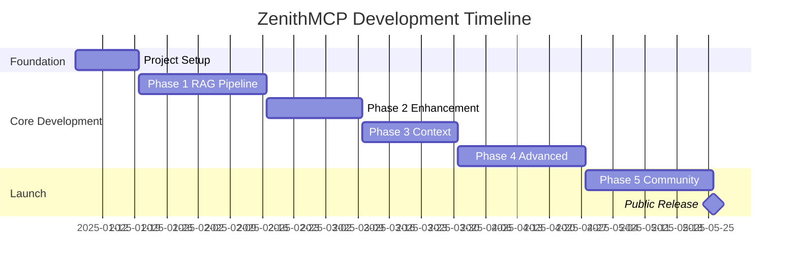

# ZenithMCP Development Plan

## Executive Summary

ZenithMCP is an open-source, high-performance server implementation of the Model Context Protocol (MCP) designed to bridge the context gap between Large Language Models and private codebases. This development plan provides a structured, phased approach to building a production-ready system that will serve as a cornerstone professional portfolio project.

## Project Objectives

### Primary Goals
- Build a robust MCP server that provides real-time code context to AI agents
- Implement a two-stage RAG pipeline optimized for source code retrieval
- Create a modular, scalable architecture suitable for enterprise deployment
- Establish best practices for open-source development and community engagement
- Demonstrate advanced software engineering skills through clean, maintainable code

### Success Metrics
- **Technical Excellence**: 90%+ test coverage, zero critical bugs in production
- **Performance**: <100ms query latency for 95th percentile requests
- **Adoption**: 100+ GitHub stars within 6 months of release
- **Community**: Active contributor base with 10+ external contributors
- **Documentation**: Comprehensive docs with API reference and tutorials

## Development Phases

### Phase 0: Foundation & Infrastructure (Weeks 1-2)
**Objective**: Establish a solid project foundation with modern tooling and best practices

#### Tasks
- [ ] Initialize project with `uv` package manager
- [ ] Set up `src/` directory structure with four core modules
- [ ] Configure `pyproject.toml` with all tool configurations
- [ ] Implement Ruff linting and formatting rules
- [ ] Set up pytest testing framework
- [ ] Create GitHub Actions CI/CD pipeline
- [ ] Initialize Sphinx documentation system
- [ ] Write comprehensive README.md
- [ ] Add LICENSE (Apache 2.0) and CONTRIBUTING.md
- [ ] Set up pre-commit hooks for code quality

#### Deliverables
- Fully configured development environment
- Passing CI pipeline with multi-version Python testing
- Basic documentation structure
- Clean, linted codebase ready for development

### Phase 1: Core RAG Pipeline (Weeks 3-6)
**Objective**: Implement the foundational data ingestion and single-stage retrieval system

#### Module: Data Ingestion Pipeline
- [ ] Implement `src/zenithmcp/ingestion/discovery.py`
  - FileWatcher for local filesystem monitoring
  - GitPoller for repository change detection
- [ ] Implement `src/zenithmcp/ingestion/chunking.py`
  - Tree-sitter integration via astchunk
  - AST-based code chunking for multiple languages
  - Support for Python, JavaScript, TypeScript initially
- [ ] Implement `src/zenithmcp/ingestion/embedding.py`
  - GraphCodeBERT integration for code embeddings
  - Batch processing for efficiency
- [ ] Implement `src/zenithmcp/ingestion/indexing.py`
  - Qdrant client setup and configuration
  - Batch upsert operations with metadata

#### Module: RAG Core (Stage 1 Only)
- [ ] Implement `src/zenithmcp/rag_core/retrieval.py`
  - Query embedding generation
  - ANN search against Qdrant
  - Top-k candidate retrieval
- [ ] Create basic query processing pipeline

#### Module: MCP Interface
- [ ] Implement `src/zenithmcp/interface/server.py`
  - FastAPI application setup
  - JSON-RPC 2.0 protocol handling
- [ ] Implement `src/zenithmcp/interface/resources.py`
  - Basic `getContextForQuery` resource
  - Error handling and validation

#### Testing & Documentation
- [ ] Unit tests for all ingestion components
- [ ] Integration tests for end-to-end pipeline
- [ ] API documentation with examples
- [ ] Performance benchmarks for baseline metrics

#### Deliverables
- Functional single-stage RAG system
- Indexed sample repository for testing
- Basic MCP server responding to queries
- 80%+ test coverage for Phase 1 modules

### Phase 2: Precision Enhancement (Weeks 7-9)
**Objective**: Add re-ranking stage and caching layer for improved accuracy and performance

#### Module: Advanced RAG Core
- [ ] Implement `src/zenithmcp/rag_core/reranking.py`
  - Cross-encoder model integration
  - Score-based filtering of candidates
  - Configurable precision thresholds
- [ ] Update retrieval pipeline for two-stage processing
- [ ] Add query optimization and preprocessing

#### Module: Caching Service
- [ ] Implement `src/zenithmcp/caching/service.py`
  - Redis setup for key-value caching
  - Semantic query cache with vector similarity
  - LRU eviction policies
- [ ] Add cache warming strategies
- [ ] Implement cache invalidation on code updates

#### Performance Optimization
- [ ] Profile and optimize hot code paths
- [ ] Implement connection pooling for databases
- [ ] Add async processing where beneficial
- [ ] Tune batch sizes for optimal throughput

#### Testing & Monitoring
- [ ] Load testing with concurrent queries
- [ ] Cache hit ratio monitoring
- [ ] Re-ranker effectiveness metrics
- [ ] A/B testing framework for model comparison

#### Deliverables
- Two-stage RAG pipeline with <100ms P95 latency
- Multi-level caching reducing compute by 50%+
- Precision metrics showing 90%+ relevance
- Production-ready monitoring and alerting

### Phase 3: Context Expansion (Weeks 10-12)
**Objective**: Enhance context quality by incorporating documentation and comments

#### Module: Documentation Processing
- [ ] Extend `src/zenithmcp/ingestion/chunking.py`
  - Markdown parser for documentation files
  - Comment extraction from source code
  - README and docstring processing
- [ ] Add specialized embedding model for natural language
- [ ] Implement hybrid search across code and docs

#### Module: Multi-Modal Retrieval
- [ ] Implement query classification (code vs. conceptual)
- [ ] Add result blending strategies
- [ ] Create context fusion algorithms
- [ ] Implement relevance feedback loops

#### Enhanced MCP Resources
- [ ] Add `getDocumentation` resource
- [ ] Implement `getRelatedConcepts` resource
- [ ] Create `explainCode` tool with doc context
- [ ] Add language-specific resource variants

#### Quality Improvements
- [ ] Implement result diversification
- [ ] Add deduplication for similar chunks
- [ ] Create quality scoring for retrieved context
- [ ] Build feedback collection mechanism

#### Deliverables
- Unified code + documentation retrieval
- 30% improvement in context relevance scores
- Extended language support (10+ languages)
- Rich metadata in all responses

### Phase 4: Advanced Features (Weeks 13-16)
**Objective**: Add sophisticated retrieval capabilities and production features

#### Module: Precision Retrieval
- [ ] Implement line-level snippet extraction
- [ ] Add syntax-aware highlighting
- [ ] Create diff-based context for changes
- [ ] Build symbol resolution and navigation

#### Module: Enterprise Features
- [ ] Add authentication and authorization
- [ ] Implement rate limiting and quotas
- [ ] Create multi-tenancy support
- [ ] Build audit logging system

#### Module: Advanced Analytics
- [ ] Usage analytics and reporting
- [ ] Query pattern analysis
- [ ] Performance metrics dashboard
- [ ] Cost tracking for cloud deployments

#### Developer Experience
- [ ] CLI tool for server management
- [ ] Docker containerization
- [ ] Kubernetes deployment manifests
- [ ] Terraform modules for cloud deployment

#### Testing & Validation
- [ ] Security audit and penetration testing
- [ ] Compliance validation (SOC2, GDPR)
- [ ] Disaster recovery testing
- [ ] Scale testing (1M+ documents)

#### Deliverables
- Production-ready enterprise features
- Comprehensive deployment options
- Security-hardened implementation
- Full operational tooling

### Phase 5: Community & Polish (Weeks 17-20)
**Objective**: Prepare for public launch and community engagement

#### Documentation & Education
- [ ] Complete API reference documentation
- [ ] Write getting started tutorials
- [ ] Create video walkthroughs
- [ ] Build example applications
- [ ] Write blog posts about architecture

#### Community Infrastructure
- [ ] Set up Discord/Slack community
- [ ] Create issue templates on GitHub
- [ ] Establish code review process
- [ ] Build contributor recognition system
- [ ] Plan virtual meetups/demos

#### Quality Assurance
- [ ] Conduct thorough code review
- [ ] Fix all outstanding bugs
- [ ] Optimize for production deployment
- [ ] Create stress test suite
- [ ] Document known limitations

#### Marketing & Outreach
- [ ] Prepare launch announcement
- [ ] Submit to Hacker News, Reddit
- [ ] Create comparison with alternatives
- [ ] Reach out to AI/ML influencers
- [ ] Submit talks to conferences

#### Deliverables
- Polished, production-ready release
- Comprehensive documentation site
- Active community channels
- Strong initial user adoption
- Conference talk acceptance

## Technical Specifications

### Architecture Components

#### 1. MCP Interface Layer
- **Framework**: FastAPI with FastMCP 2.0
- **Protocol**: JSON-RPC 2.0 over HTTP/SSE
- **Authentication**: OAuth2/API keys
- **Rate Limiting**: Token bucket algorithm
- **Monitoring**: OpenTelemetry integration

#### 2. RAG Core Engine
- **Stage 1**: GraphCodeBERT embeddings + Qdrant ANN search
- **Stage 2**: Cross-encoder reranking model
- **Languages**: Python, JS, TS, Go, Rust, Java, C++
- **Chunk Size**: 50-500 lines (function/class level)
- **Context Window**: 5-10 final chunks

#### 3. Caching Service
- **L1 Cache**: Redis for embeddings/responses
- **L2 Cache**: Semantic similarity cache
- **TTL**: Configurable per cache type
- **Invalidation**: Git hook triggered
- **Warmup**: Async background process

#### 4. Data Ingestion Pipeline
- **Parser**: Tree-sitter for AST generation
- **Batch Size**: 100 files per batch
- **Parallelism**: Multiprocessing pool
- **Incremental**: Git diff-based updates
- **Languages**: Extensible plugin system

### Performance Targets

| Metric | Target | Measurement |
|--------|--------|-------------|
| Query Latency (P50) | <50ms | End-to-end response time |
| Query Latency (P95) | <100ms | End-to-end response time |
| Query Latency (P99) | <200ms | End-to-end response time |
| Throughput | 1000 QPS | Single instance capacity |
| Index Time | <1s/file | Average processing time |
| Memory Usage | <4GB | Baseline memory footprint |
| Cache Hit Rate | >70% | Semantic cache effectiveness |

### Quality Standards

#### Code Quality
- **Test Coverage**: Minimum 90% for all modules
- **Linting**: Zero Ruff violations
- **Type Coverage**: 100% with mypy strict mode
- **Documentation**: All public APIs documented
- **Complexity**: Cyclomatic complexity <10

#### Security
- **SAST**: Automated security scanning
- **Dependencies**: Regular vulnerability scanning
- **Secrets**: No hardcoded credentials
- **Input Validation**: All user inputs sanitized
- **Rate Limiting**: DDoS protection

#### Reliability
- **Uptime**: 99.9% availability target
- **Error Rate**: <0.1% failed requests
- **Recovery**: <5min for service restart
- **Backups**: Daily automated backups
- **Monitoring**: Real-time alerting

## Risk Management

### Technical Risks

| Risk | Impact | Probability | Mitigation |
|------|--------|-------------|------------|
| GraphCodeBERT performance issues | High | Medium | Benchmark alternatives, implement fallback |
| Qdrant scalability limits | High | Low | Design for horizontal sharding |
| Tree-sitter language support | Medium | Medium | Create fallback regex parsers |
| Latency requirements not met | High | Medium | Aggressive caching, query optimization |
| Memory consumption too high | Medium | Medium | Implement streaming, pagination |

### Project Risks

| Risk | Impact | Probability | Mitigation |
|------|--------|-------------|------------|
| Scope creep | High | High | Strict phase boundaries, feature freeze |
| Lack of community adoption | High | Medium | Early user engagement, clear value prop |
| Competing solutions emerge | Medium | High | Focus on unique features, fast iteration |
| Contributor burnout | Medium | Medium | Clear guidelines, recognition system |
| Technical debt accumulation | High | Medium | Regular refactoring sprints |

## Success Criteria

### Launch Milestones
- [ ] 100+ GitHub stars in first week
- [ ] 10+ production deployments in month 1
- [ ] Featured in AI/ML newsletters
- [ ] Positive feedback from 5+ enterprises
- [ ] Conference talk acceptance

### Long-term Goals
- [ ] 1000+ GitHub stars
- [ ] 50+ active contributors
- [ ] Integration with major AI platforms
- [ ] Commercial support offerings
- [ ] Industry standard adoption

## Resource Requirements

### Development Team
- **Core Developer**: 20 hours/week for 20 weeks
- **Documentation**: 5 hours/week for final 8 weeks
- **DevOps**: 5 hours/week for deployment phases
- **UI/UX**: 10 hours total for dashboard design

### Infrastructure
- **Development**: Local machines + GitHub Codespaces
- **CI/CD**: GitHub Actions (free tier)
- **Testing**: Cloud VMs for load testing ($200/month)
- **Production Demo**: AWS/GCP credits ($500/month)
- **Vector Database**: Qdrant Cloud free tier initially

### Tools & Services
- **GitHub**: Repository, issues, actions (free)
- **Discord**: Community management (free)
- **Documentation**: ReadTheDocs (free for OSS)
- **Monitoring**: Grafana Cloud free tier
- **Analytics**: Plausible Analytics ($9/month)

## Timeline Summary

## Communication Plan

### Internal Updates
- Weekly development logs
- Bi-weekly architecture reviews
- Monthly steering meetings
- Quarterly roadmap reviews

### External Communication
- Bi-weekly blog posts during development
- Monthly community updates
- Release notes for each phase
- Conference talks and podcasts

## Conclusion

The ZenithMCP project represents a significant opportunity to create a valuable open-source tool while demonstrating advanced software engineering capabilities. This phased development plan provides a clear path from concept to production-ready system, with built-in checkpoints for validation and course correction.

The modular architecture and comprehensive testing strategy ensure that the project will be maintainable and extensible long after the initial development phase. By focusing on community engagement and developer experience from the beginning, ZenithMCP is positioned to become a cornerstone tool in the AI-assisted development ecosystem.

Success will be measured not just by technical metrics, but by real-world adoption and the positive impact on developer productivity. This project will serve as a powerful addition to any professional portfolio, demonstrating expertise in modern Python development, distributed systems, machine learning integration, and open-source project management.